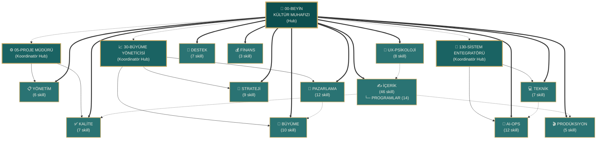

# OLUK Skill Sistemi - Hub İlişki Haritası

## 🧠 Merkezi Hub: 00-BEYİN (KÜLTÜR MUHAFIZI)

OLUK'un 130 skill'inden oluşan mikro-worker sistemi, 00-Beyin merkezli bir hub-and-spoke yapısındadır.



## 🔑 Hub Yapısı Açıklaması

### 🧠 00-BEYİN (Merkezi Hub)
- **Rol:** Kültür Muhafızı, marka sesi koruyucusu
- **Bağlantı:** Tüm 130 skill'e direkt bağlı
- **Sorumluluk:** Final kalite onayı, kültürel değerler standardı

### ⚙️ 05-PROJE MÜDÜRÜ (Koordinatör Hub)
- **Rol:** Operasyonel koordinasyon
- **Alan:** YÖNETİM, KALİTE departmanları
- **Sorumluluk:** Sprint, deadline, kaynak yönetimi

### 📈 30-BÜYÜME YÖNETİCİSİ (Koordinatör Hub)
- **Rol:** Growth hub'ı
- **Alan:** BÜYÜME, PAZARLAMA, STRATEJİ departmanları
- **Sorumluluk:** Viral stratejiler, metrik takibi

### 🔗 130-SİSTEM ENTEGRATÖRÜ (Koordinatör Hub)
- **Rol:** Teknik koordinasyon
- **Alan:** TEKNİK, AI-OPS departmanları
- **Sorumluluk:** 130 skill arası entegrasyon, sistem sağlığı

## 📊 Departman Dağılımı

| Departman | Skill Sayısı | % | Koordinatör |
|-----------|--------------|---|-------------|
| İÇERİK | 46 | 35.4% | 00-Beyin |
| PAZARLAMA | 12 | 9.2% | 30-Büyüme |
| AI-OPS | 12 | 9.2% | 130-Entegratör |
| BÜYÜME | 10 | 7.7% | 30-Büyüme |
| STRATEJİ | 9 | 6.9% | 30-Büyüme |
| UX-PSİKOLOJİ | 8 | 6.2% | 00-Beyin |
| TEKNİK | 7 | 5.4% | 130-Entegratör |
| DESTEK | 7 | 5.4% | 00-Beyin |
| KALİTE | 7 | 5.4% | 05-Proje |
| YÖNETİM | 6 | 4.6% | 05-Proje |
| PRODÜKSIYON | 5 | 3.8% | 00-Beyin |
| FİNANS | 3 | 2.3% | 00-Beyin |
| **TOPLAM** | **130** | **100%** | |

## 🔄 Departmanlar Arası Ana Akışlar

### İçerik Üretim Akışı
```
İÇERİK → UX-PSİKOLOJİ → PRODÜKSIYON → KALİTE → 00-Beyin (Onay)
```

### Growth & Marketing Akışı
```
STRATEJİ → PAZARLAMA → BÜYÜME → 30-Büyüme (Koordinasyon)
```

### Teknik Geliştirme Akışı
```
TEKNİK → AI-OPS → 130-Entegratör (Senkronizasyon)
```

### Kullanıcı Desteği Akışı
```
DESTEK → KALİTE → YÖNETİM → 05-Proje (Eskalasyon)
```

## 📖 Kullanım

### Yeni Skill Eklerken
1. Uygun departmanı belirle
2. İlgili hub'a bağla (00-Beyin + koordinatör hub)
3. İlişkili skill'lerle bağlantıyı kur
4. `**Bağlı:**` alanını güncelle

### Skill İlişkilerini Kontrol Etmek
```bash
# Bir skill'in bağlantılarını görmek için:
grep -A5 "## ETKİLEŞİM" _SKILLS/[DEPARTMAN]/[skill].md

# Orphan skill'leri bulmak için:
bash scripts/audit-skills.sh
```

---

*Son Güncelleme: 29 Aralık 2025*  
*Hub Yapısı: 1 Merkezi + 3 Koordinatör + 12 Departman*  
*Toplam Skill: 130*
