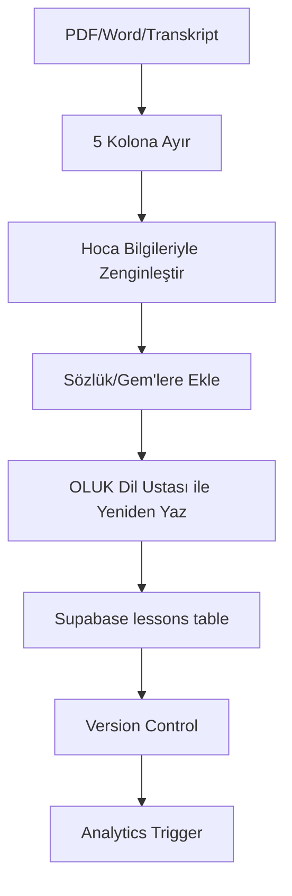

# 🌊 OLUK MEGA SİSTEM v1.0

**Dijital İnziva Ekosistemi - Kapsamlı Teknik ve Stratejik Planlama Dokümanı**

**Last Updated:** 21 Aralık 2025  
**Source:** OLUK MEGA SİSTEM_v1.docx (16 araştırma sentezi)  
**Status:** 🟢 Active Development

*"Akışın Kanalı, Dönüşümün Yolu"*

---

## 📑 İÇİNDEKİLER

1. [Yönetici Özeti](#yonetici-ozeti)
2. [Teknik Mimari](#teknik-mimari)
3. [Veritabanı Şeması](#veritabani-semasi)
4. [Kullanıcı Yolculuğu](#kullanici-yolculugu)
5. [Ders ve Seans Mimarisi](#ders-seans-mimarisi)
6. [AI Entegrasyonu (Nur Koçu)](#ai-entegrasyon)
7. [İçerik Üretim Pipeline](#icerik-uretim)
8. [Monetizasyon Modeli](#monetizasyon)
9. [Domain Authority Stratejisi](#domain-authority)
10. [Email Marketing](#email-marketing)
11. [Context Yönetimi](#context-yonetimi)
12. [Uygulama Takvimi](#uygulama-takvimi)
13. [Kritik Uyarılar](#kritik-uyarilar)

---

<a name="yonetici-ozeti"></a>
## 1. YÖNETİCİ ÖZETİ

OLUK (oluk.org), Türkiye'nin ilk sistematik dijital spiritüel eğitim platformudur. Yücel Balkancı Hoca'nın öğretilerini, modern teknoloji ve psikoloji ile birleştirerek **'Dijital İnziva'** deneyimi sunar.

### Vizyon
**Seküler vitrin, Rabbani öz (Gizli İrşad). Osmanlı Cyberpunk estetiği. Enterprise-level kalite.**

### Hedef Kitle
- **Yaş:** 25-55
- **Cinsiyet:** %95 kadın
- **Profil:** Kentli, eğitimli, manevi arayış içinde
- **İhtiyaç:** Stres yönetimi, iç huzur, sistematik gelişim

### Rekabet Avantajı
1. **Sistematik:** 10+ ders, yapılandırılmış müfredat
2. **Kültürel:** Türk-İslam geleneğine özgü içerik
3. **Topluluk:** Deneyim paylaşımı ve destek ağı
4. **Teknoloji:** AI koç, kişiselleştirme, gamification

### Pazar Fırsatı
**Global meditasyon uygulama pazarı 2025'te $5.7B, CAGR %6.7.**

- Calm: $7.7M/ay
- Headspace: $4M/ay
- **Türkiye'de Meditopia lider ancak OLUK'un sunduğu sistematik spiritüel eğitim yok**

---

<a name="teknik-mimari"></a>
## 2. TEKNİK MİMARİ

### 2.1 Teknoloji Stack

| **Katman** | **Teknoloji** |
|-----------|---------------|
| Frontend | React/Next.js + Tailwind CSS + Lottie Animations |
| Backend | Supabase (PostgreSQL + Auth + Storage + Realtime) |
| AI/ML | OpenAI/Claude API + Pinecone (RAG) + LangGraph |
| Otomasyon | n8n (self-hosted) + Cloudinary Pro |
| Analytics | Mixpanel (retention, funnel, A/B test) |
| Hosting | Vercel (frontend) + Supabase Cloud (backend) |

### 2.2 Bileşenler

#### Frontend Components
- Next.js 14 (App Router)
- Tailwind CSS (utility-first)
- Framer Motion (animations)
- Lottie Animations (micro-interactions)
- Phosphor Icons (duotone weight)

#### Backend Services
- **Supabase:**
  - PostgreSQL (relational data)
  - Auth (email, Google OAuth)
  - Storage (audio files, images)
  - Realtime (live updates)
- **n8n:** Workflow automation
- **Cloudinary:** Media optimization (dzegofdgp)

#### AI Layer
- **Claude Sonnet 4:** Primary LLM (Nur Koçu)
- **OpenAI GPT-4:** Fallback/specialized tasks
- **Pinecone:** Vector database (RAG)
- **text-embedding-3-small:** Embedding model
- **LangGraph:** Orchestration framework

---

<a name="veritabani-semasi"></a>
## 3. VERİTABANI ŞEMASI (Supabase)

### 3.1 Kullanıcı Tabloları

#### users
```sql
id: UUID PRIMARY KEY
email: VARCHAR UNIQUE
name: VARCHAR
avatar_url: VARCHAR
created_at: TIMESTAMP
last_login: TIMESTAMP
```

#### user_profiles
```sql
user_id: UUID FK -> users.id
mood_baseline: VARCHAR
energy_level: INTEGER
preferences_json: JSONB
niyet: TEXT
created_at: TIMESTAMP
updated_at: TIMESTAMP
```

#### user_progress
```sql
user_id: UUID FK -> users.id
lesson_id: UUID FK -> lessons.id
status: ENUM(not_started, in_progress, completed)
completed_at: TIMESTAMP
score: INTEGER
```

#### user_streaks
```sql
user_id: UUID FK -> users.id
current_streak: INTEGER DEFAULT 0
longest_streak: INTEGER DEFAULT 0
last_activity: DATE
streak_freeze_count: INTEGER DEFAULT 0
```

#### user_achievements
```sql
user_id: UUID FK -> users.id
badge_id: UUID FK -> badges.id
earned_at: TIMESTAMP
```

### 3.2 İçerik Tabloları

#### lessons
```sql
id: UUID PRIMARY KEY
title: VARCHAR
description: TEXT
order: INTEGER
duration: INTEGER (minutes)
difficulty: ENUM(beginner, intermediate, advanced)
content_json: JSONB  -- 5 kolon yapısı
status: ENUM(draft, published)
created_at: TIMESTAMP
```

**content_json Yapısı:**
```json
{
  "envanter": "Öz-değerlendirme soruları",
  "teshis": "Blokaj analizi",
  "protokol": "Adım adım rehber",
  "bilgiBankasi": "Teorik kavramlar",
  "guvenlik": "Uyarılar"
}
```

#### sessions
```sql
id: UUID PRIMARY KEY
lesson_id: UUID FK -> lessons.id
title: VARCHAR
type: ENUM(breathing, meditation, visualization, journal)
duration: INTEGER (minutes)
audio_url: VARCHAR (Cloudinary)
script_json: JSONB  -- 4 faz yapısı
created_at: TIMESTAMP
```

**script_json Yapısı (4 Faz):**
```json
{
  "hazirlik": {
    "sure": 5,
    "adimlar": ["Mood check", "Niyet", "Nefes uyumu"]
  },
  "arinma": {
    "sure": 10,
    "adimlar": ["Topraklama", "Tarama", "Temizleme"]
  },
  "aktivasyon": {
    "sure": 15,
    "adimlar": ["Chakra", "Görselleştirme", "Telkin"]
  },
  "entegrasyon": {
    "sure": 5,
    "adimlar": ["Dönüş", "Journal", "Mühürleme"]
  }
}
```

#### dictionary
```sql
id: UUID PRIMARY KEY
term: VARCHAR UNIQUE
definition: TEXT
category: VARCHAR
related_terms: VARCHAR[]
created_at: TIMESTAMP
```

#### gems
```sql
id: UUID PRIMARY KEY
content: TEXT
category: VARCHAR
source: VARCHAR (Hoca öğretisi, ders, vs.)
created_at: TIMESTAMP
```

### 3.3 Etkileşim Tabloları

#### mood_logs
```sql
id: UUID PRIMARY KEY
user_id: UUID FK -> users.id
mood_type: VARCHAR  -- Plutchik wheel (1000 durum)
energy_level: INTEGER (1-10)
notes: TEXT
timestamp: TIMESTAMP
```

**Plutchik Wheel + 1000 Durum Sistemi:**
- Temel 8: sevinç, güven, korku, sürpriz, üzüntü, iğrenme, öfke, beklenti
- Alt duygular: 992 varyasyon (enerji seviyesi + yoğunluk kombinasyonları)

#### session_completions
```sql
id: UUID PRIMARY KEY
user_id: UUID FK -> users.id
session_id: UUID FK -> sessions.id
duration: INTEGER (actual minutes)
feedback: INTEGER (1-5 stars)
notes: TEXT
timestamp: TIMESTAMP
```

#### journal_entries
```sql
id: UUID PRIMARY KEY
user_id: UUID FK -> users.id
content: TEXT
mood_before: VARCHAR
mood_after: VARCHAR
timestamp: TIMESTAMP
```

#### community_posts
```sql
id: UUID PRIMARY KEY
user_id: UUID FK -> users.id
content: TEXT
type: ENUM(experience, question, insight)
likes: INTEGER DEFAULT 0
comments: INTEGER DEFAULT 0
timestamp: TIMESTAMP
```

---

<a name="kullanici-yolculugu"></a>
## 4. KULLANICI YOLCULUĞU

### 4.1 Onboarding (İlk 5 Dakika)

**KRITIK:** İlk 3 gün içinde %77 kullanıcı terk ediyor. Onboarding < 1 dakika olmalı.

#### Adımlar
1. **Hoş Geldin Ekranı**
   - "Dijital inzivanıza hoş geldiniz"
   - Kısa animasyon (Lottie)
   - Motivasyon cümlesi

2. **Hızlı Profil**
   - İsim + E-posta
   - Google ile giriş seçeneği
   - Avatar seçimi (opsiyonel)
3. **Niyet Belirleme** - "Neden buradasın?"
4. **İlk Nefes (3dk)** - Guided breathing
5. **Rozet Kutlaması** - "İlk Adım" badge

### İlk 7 Gün Stratejisi (%77 terk önleme)
```
Gün 1: Kapı Dersi (15dk)
Gün 2: İlk mood log + streak başlangıcı
Gün 3: Topluluk tanıtımı
Gün 4: Nur Koçu tanışma
Gün 5: İlk gamification milestone
Gün 6: Premium teaser
Gün 7: Haftalık Yolcu rozeti + kutlama
```

### Gamification (Duolingo Model)
- **Streak:** Ateş ikonu 🔥
- **Loss Aversion:** "1 gün kaldı, streak kaybolacak!"
- **Streak Freeze:** 2 hak (premium)
- **Rozetler:**
  - İlk Adım (1. seans)
  - Haftalık Yolcu (7 gün streak)
  - Ders Ustası (1 ders tamamla)
  - Topluluk Lideri (10 yorum)
  - Mentor (yeni üye davet)

---

<a name="ders-mimari"></a>
## 📚 DERS/SEANS MİMARİSİ

### 5 Kolon Yapısı
```json
{
  "envanter": "Öz-değerlendirme soruları",
  "teshis": "Blokaj analizi ve pattern tanıma",
  "protokol": "Adım adım uygulama rehberi",
  "bilgiBankasi": "Teorik kavramlar ve arka plan",
  "guvenlik": "Uyarılar ve kriz yönetimi"
}
```

### 4 Faz Seans Yapısı
```json
{
  "1_hazirlik": {
    "sure": "5dk",
    "adimlar": [
      "Mood seçimi (Plutchik çarkı)",
      "Niyet belirleme",
      "Nefes uyumu (4-7-8)"
    ]
  },
  "2_arinma": {
    "sure": "10dk",
    "adimlar": [
      "Topraklama (5 duyu)",
      "Beden tarama",
      "Blokaj temizleme"
    ]
  },
  "3_aktivasyon": {
    "sure": "15dk",
    "adimlar": [
      "Chakra aktivasyonu",
      "Görselleştirme",
      "Telkin/mantra",
      "Enerji akışı"
    ]
  },
  "4_entegrasyon": {
    "sure": "5dk",
    "adimlar": [
      "Dönüş (5-4-3-2-1)",
      "Journal yazma",
      "Günlük transfer",
      "Mühürleme"
    ]
  }
}
```

### Örnek: Ders 2 (Yasin Kapısı)
- **Süre:** 40 gün pratik
- **Kavramlar:**
  - 8 Kalkan (koruma sistemi)
  - Spiral Beyaz Alev (saflaştırma)
  - Zarafetin Akışı (estetik bilinç)
  - 4 Beden (fiziksel-eterik-astral-mental)
  - Kollektif Bilinçaltı (Jung integration)

**Not:** Derin transformasyon şart, yüzeysellik yok.

---

<a name="ai-entegrasyon"></a>
## 🤖 AI ENTEGRASYONU - NUR KOÇU

### RAG Mimarisi
```
1. Pinecone Vector DB
2. text-embedding-3-small (Embedding)
3. Claude Sonnet 4 (LLM)
4. LangGraph (Orchestration)
5. Sliding window + summarization (Context)
```

### Bilgi Tabanı
- Dersler & seanslar (tüm 5 kolon)
- OLUK sözlüğü (terimler)
- Gem'ler (ilham notları)
- Hoca öğretileri (transkriptler)

### Guardrails
```javascript
const rules = {
  yanit: "Sadece OLUK içeriğinden",
  tibbi: "Verme - psycholog/doctor yönlendir",
  kriz: {
    intihar: "182 hattına yönlendir",
    disosiyasyon: "Hemen uzman çağır",
    panik: "Grounding teknikleri ver"
  },
  eminDegilsen: "Hocamıza danışalım de",
  kaynak: "Her yanıtı kaynakla"
};
```

### Kişiselleştirme Faktörleri
- Tamamlanan dersler
- Mood pattern analizi
- Tercih profili (visual/audio/kinesthetic)
- Niyet uyumu

---

<a name="icerik-uretim"></a>
## ✍️ İÇERİK ÜRETİM PIPELINE



---

<a name="yazim-stili"></a>
## 📝 YAZIM STİLİ - OSMANLI CYBERPUNK

### Kurallar
- ✅ Kısa cümle (max 15 kelime)
- ✅ Vurucu, keskin
- ❌ Klişeden kaçın ("derin nefes al", "içine bak")
- ✅ Teşbih damıtılmış vecd'le
- ✅ Betimleme ahlaki derinlikte
- ✅ Metinlerarası (klasik → modern)

### Referans Yazarlar & Üslupları

| Yazar | Üslup Özü | Kullanım |
|-------|-----------|----------|
| **İsmet Özel** | Damıtma (distillation) | Sözü yoğunlaştır |
| **Ahmet Turan Alkan** | Mizahlı özeleştiri | İroni katmanı |
| **Cemil Meriç** | Teşbihli sentez | Benzetme sanatı |
| **Necip Fazıl** | Vecd (ecstatic flow) | Coşku akışı |
| **Ahmet Hamdi Tanpınar** | Estetik zaman | Bellek oyunu |
| **Peyami Safa** | Ahlaki betimleme | Vicdan muhasebesi |
| **Hilmi Yavuz** | Metinlerarası | Kültürel katmanlar |

### Örnek Dönüşümler

❌ **Önce:** "Derin bir nefes alın ve rahatlamaya çalışın."  
✅ **Sonra:** "Ciğere çek. Toprak gibi otur."

❌ **Önce:** "İçinize bakın ve duygularınızı gözlemleyin."  
✅ **Sonra:** "Bak geç, gör geç, takılma geç."

❌ **Önce:** "Kendinizi affetmeyi öğrenin."  
✅ **Sonra:** "Suçu bırak. Yükü at."

---

<a name="sosyal-medya"></a>
## 📱 SOSYAL MEDYA OTOMASYONU (n8n)

### Daily Gem (07:00)
```yaml
trigger: cron("0 7 * * *")
action:
  - Pinecone'dan random gem
  - Görsel üret (Midjourney API)
  - Platform post:
      Instagram: Kare görsel + caption
      TikTok: 15sn Lottie animasyon
      X: İlham tweet
      YouTube Shorts: Sesli gem
```

### Weekly Summary (Pazar 18:00)
```yaml
trigger: cron("0 18 * * 0")
action:
  - Haftalık istatistikler
  - Top 3 gem
  - Topluluk highlight
```

### Milestone Celebration (Event-driven)
```yaml
trigger: database_event("user_progress")
condition: streak_days IN [7, 30, 100]
action:
  - Rozet unlock
  - Push notification
  - Social share teşvik
```

### YouTube Rakip Analizi
```yaml
trigger: weekly
action:
  - Transcript API ile içerik çek
  - AI tema/keyword analizi
  - OLUK adaptasyonu öner
  - Content calendar'a ekle
```

---

<a name="monetizasyon"></a>
## 💳 MONETİZASYON

### Freemium Model

| Tier | Fiyat | İçerik |
|------|-------|--------|
| **Free** | 0 TL | Ders 1-2, temel Nur Koçu |
| **Premium** | 99 TL/ay | Tüm dersler, sınırsız AI, topluluk |
| **Enterprise** | Custom | B2B wellness, dashboard, raporlama |

### Conversion Funnel
```
100 signup
↓ %70 onboarding complete
70 aktif
↓ %12 premium convert (benchmark %5-10)
8 ödeme
```

### Metrikler & Hedefler
- **D1 Retention:** %85
- **D7 Retention:** %55
- **D30 Retention:** %16
- **LTV/CAC:** 3:1 (hedef)
- **İlk Yıl Hedef:** 1K premium = 100K TL/ay

### B2B: OLUK for Teams
- **Paket:** Kurumsal wellness programı
- **Fiyat:** 50 TL/kişi/ay (min 20 kişi)
- **Özellikler:**
  - Admin dashboard
  - Aggregate analytics
  - Custom branding
  - Dedicated support

---

<a name="seo"></a>
## 🔍 SEO & DOMAIN AUTHORITY

### Keyword Stratejisi

**Primary Keywords:**
- meditasyon dersleri
- chakra temizliği
- enerji çalışması
- türkçe meditasyon

**Long-tail Keywords:**
- online manevi gelişim kursu
- stres yönetimi meditasyonu
- chakra açma teknikleri

### Content Pillars
1. **Chakra Rehberi** (7 makale - her chakra için)
2. **Meditasyon Teknikleri** (10 makale)
3. **Enerji Temizliği** (5 makale)

### Backlink Stratejisi
**Faz 1:** 50 makale (internal linking sistemi)  
**Faz 2:** 10 guest post + 5 influencer collaboration  
**Faz 3:** Araştırma yayını + podcast appearance

---

<a name="email"></a>
## 📧 EMAIL MARKETING

### Welcome Series (7 email)
```
Day 1: Hoş geldin + ilk seans davet
Day 2: Sistem tanıtımı (5 kolon, 4 faz)
Day 3: İlk ders keşfi
Day 4: Topluluk davet
Day 5: Progress kutlama
Day 6: 7 gün kutlama + streak vurgusu
Day 7: Premium teaser
```

### Re-engagement Kampanyaları
```
3 gün inaktif: "Özledik 💙" + motivasyon
7 gün inaktif: Özel içerik + geri dönüş teklifi
30 gün inaktif: %20 discount + son şans
```

### Nurture (Behavior-Triggered)
```
Ders tamamla → Sonraki ders öneri
Mood log → İlgili içerik öner
Streak risk → "Kaybetme!" uyarısı
Badge unlock → Kutlama + paylaş
```

---

<a name="context"></a>
## 🧠 CONTEXT YÖNETİMİ

### ANTGRAVITY_BEYIN.md (Kalıcı Hafıza)
- Sistem mimarisi
- Ders içerikleri
- Yazım stili referansları
- Kemal tercihleri ve uyarıları

### CHECKPOINT.md (Anlık İlerleme)
```markdown
# CURRENT PHASE: [Sprint adı]
# TASK: [Aktif görev]
# PROGRESS: [%85]

## COMPLETED
- [x] Task 1
- [x] Task 2

## IN PROGRESS
- [ ] Task 3 (%60)

## PENDING
- [ ] Task 4

## BLOCKED
- [ ] Task 5 (dependency: X)

## NEXT
- [ ] Task 6
```

---

<a name="uyarilar"></a>
## ⚠️ KRİTİK UYARILAR (Kemal'den)

### Kalite Standartları
1. ✅ **EN İYİSİ yap** - Üstünkörü yok
2. ✅ **Küçük başla büyütme yok** - Baştan doğru inşa et
3. ✅ **Her push öncesi test** - DevTools mobile 3 boyut

### Kültürel Kurallar
- ❌ **Besmele/dini sembol YASAK** (bilinçaltı iletişim yeterli)
- ❌ **Kapkara site YASAK** (%95 kadın kitle)
- ❌ **Hoca sesi yok** (AI Kemal sağlayacak)

### Workflow Kuralları
- 📝 **Kod yazmadan Gem'e gönder** (önce plan)
- 🤖 **Antgravity'ye adım adım iş ver** (task breakdown)
- 🌙 **Upload gece** (low traffic)
- 📚 **Önceki çalışmaları oku** (wheel reinvent yok)

### Mood Sistemi
- **1000 ruh hali** (Plutchik çarkı + custom genişletme)
- **Pattern recognition** (AI analytics ile trend tespiti)

### Çalışma Felsefesi
> **"BAK GEÇ, GÖR GEÇ, TAKILMA GEÇ"**

---

## 📊 UYGULAMA TAKVİMİ (12 Hafta)

### Hafta 1-2: Altyapı
- Supabase setup & RLS
- Auth flow (email/Google)
- UI component library
- Mobil responsive fix

### Hafta 3-4: MVP Core
- Dashboard & Ana sayfa
- Ders tracking sistemi
- Streak & progress bar
- Basic gamification

### Hafta 5-6: Seanslar
- Mood log UI (Plutchik wheel)
- Audio player (Cloudinary)
- Feedback form
- Progress chart visualization

### Hafta 7-8: AI & Topluluk
- Nur Koçu RAG pipeline
- Forum/yorum sistemi
- User profiles & avatars

### Hafta 9-10: Gamification & Polish
- Rozet sistemi
- Push notifications
- Lottie animasyonlar
- Landing page optimize

### Hafta 11-12: Launch
- Premium entegrasyonu (iyzico)
- Email marketing setup (n8n)
- Analytics dashboard
- Beta test & soft launch

---

## 🔐 GÜVENLİK & UYUM

### Veri Koruma
- KVKK uyumlu (Türkiye GDPR)
- Supabase RLS (Row Level Security)
- Şifreli veri depolama
- GDPR deletion requests

### Kriz Protokolleri
```javascript
const crisisDetection = {
  keywords: ["intihar", "canıma kıymak", "dayanamıyorum"],
  action: {
    priority: "URGENT",
    response: "182 Alo Kriz hattına yönlendir",
    notification: "Admin alert gönder",
    logging: "Crisis log table'a kaydet"
  }
};
```

---

## 📞 EKIP & ROL DAĞILIMI

**Proje Sahibi & Vizyon:** Kemal  
**PM & Developer:** Claude (Sonnet 4.5)  
**AI Koç:** Nur Koçu (Claude-powered RAG)  
**Spiritüel Rehber:** Hoca (AI Kemal voice - gelecek)

---

## 📚 REFERANS DOKÜMANLARI

1. **OLUK MEGA SİSTEM_v1.docx** - Ana sistem dökümanı
2. **MEMORY_CONTEXT.md** - Project context & approach
3. **CHECKPOINT.md** - Sprint progress tracking
4. **ANTGRAVITY_BEYIN.md** - Permanent knowledge base

---

**Son Güncelleme:** 21 Aralık 2025  
**Doküman Versiyonu:** 1.0  
**Durum:** 🟢 Aktif Geliştirme

---

*"Akışın kanalı, dönüşümün yolu - OLUK"*
